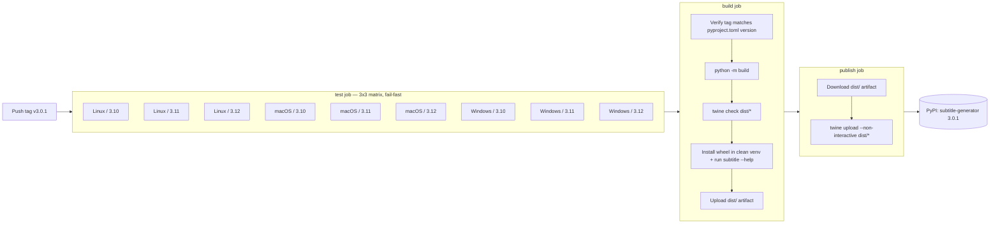

# Changelog

All notable changes to `subtitle-generator` are documented in this file.

The format follows [Keep a Changelog](https://keepachangelog.com/en/1.1.0/) and the
project adheres to [Semantic Versioning](https://semver.org/spec/v2.0.0.html).

## [3.0.3] - 2026-04-28

### Added
- **`subtitle setup-whisper` subcommand.** Clones, builds, and installs the
  project's compatible whisper.cpp fork (`innovatorved/whisper.cpp`,
  `develop` branch) into the per-OS user data dir using CMake. Subsequent
  `subtitle <video>` invocations auto-discover the installed binary and
  Just Work — no env vars, no PATH setup, no flags. Flags:
  - `--repo URL` to point at a different fork
  - `--ref TAG_OR_BRANCH` to pin a specific revision
  - `--force` to wipe and re-clone
  - `--no-pull` for offline rebuilds
- New helpers in `subtitle_generator.utils.paths`: `default_data_dir()`,
  `installed_whisper_binary()`, `installed_whisper_binary_target()`. They
  expose the install location (e.g. `~/Library/Application Support/
  subtitle-generator/bin/whisper-cli` on macOS) so third-party Python API
  callers can introspect or reset state programmatically.
- New module `subtitle_generator.utils.whisper_setup` with the build
  pipeline (`setup_whisper()`, `WhisperSetupError`,
  `WhisperSetupResult`).
- New environment variable `SUBTITLE_DATA_DIR` to relocate the data dir
  (clone + binary) — useful for CI sandboxes and Docker volumes.

### Changed
- **`find_whisper_binary` lookup order now puts the
  `setup-whisper`-installed binary above system PATH.** This means
  `brew install whisper-cpp 1.8.4` (which dropped the `-vi` flag and
  rejects `.mp4` directly) is automatically *bypassed* once the user has
  run `subtitle setup-whisper`, eliminating an entire class of
  "transcription silently produces no output" reports. Final order:
  explicit flag → env var → user-data-dir install → PATH → legacy
  checkout layout.
- `whisper_binary_install_hint()` now leads with `subtitle setup-whisper`
  as the recommended fix and shows OS-specific toolchain install
  commands. Manual `SUBTITLE_WHISPER_BINARY` / `--whisper-binary`
  remain as escape hatches.

### Why
Even after 3.0.2's discovery logic, getting a *working* `whisper-cli` on
macOS was a coin flip: Homebrew's `whisper-cpp` formula ships 1.8.4,
which silently exits 0 on `.mp4` input and writes no output file
(because `-vi` was removed upstream). 3.0.3 makes "build a known-good
binary" a single, repeatable command instead of a manual chore, and
makes that build the preferred discovery target.

## [3.0.2] - 2026-04-28

### Fixed
- **Critical: pip-installed CLI is now actually usable.** Previous releases
  hardcoded `./binary/whisper-cli` as the transcription binary path, which
  only resolved when running from this project's git checkout. Installed
  via `pip install subtitle-generator`, the CLI failed every transcription
  with `/bin/sh: ./binary/whisper-cli: No such file or directory`. The
  binary is now discovered at runtime via, in order: an explicit
  `--whisper-binary` flag, the `SUBTITLE_WHISPER_BINARY` env var,
  `shutil.which("whisper-cli" | "whisper-cpp" | "main")` against `PATH`,
  and finally the legacy `./binary/whisper-cli` checkout layout for
  backwards compatibility.
- **Models cache directory no longer pollutes the user's CWD.** The default
  `models_dir` was the literal string `"models"`, so each invocation
  created a `models/` folder wherever the user happened to `cd` to. The
  default now resolves per-OS to a user cache location:
  `~/Library/Caches/subtitle-generator/models` on macOS,
  `$XDG_CACHE_HOME/subtitle-generator/models` (or `~/.cache/...`) on Linux,
  `%LOCALAPPDATA%/subtitle-generator/Cache/models` on Windows. Override
  with `--models-dir` or `SUBTITLE_MODELS_DIR`.
- **Clear, actionable error when the binary is missing.** Instead of
  letting `/bin/sh` raise a cryptic "no such file or directory", the
  CLI now raises a `TranscriptionError` at startup that names the OS,
  shows the install command (`brew install whisper-cpp` on macOS, build
  steps on Linux, release link on Windows), and explains the override
  mechanisms. Errors are surfaced before any model download starts.
- **`subprocess` no longer uses `shell=True`.** The transcription command
  is now invoked with an `argv` list via `subprocess.run`, eliminating a
  whole class of quoting / injection bugs on filenames containing spaces,
  quotes, or shell metacharacters. Aligns with the project's
  "Avoid Synchronous `child_process` and Shell Execution" rule.
- Transient transcription output now lands in the OS temp dir (e.g.
  `/tmp/subtitle-generator/<uuid>.srt`) and is renamed next to the input
  video, instead of creating a `data/` folder in the user's CWD.
- `subtitle_generator.__version__` was stuck at `"2.0.2"`. It now matches
  the distribution version reported by `importlib.metadata`.

### Added
- New module `subtitle_generator.utils.paths` with public helpers
  `find_whisper_binary()`, `whisper_binary_install_hint()`,
  `default_models_dir()`, `default_output_dir()`. Callers (including
  third-party Python API users) can reuse the same resolution logic.
- New CLI flags: `--whisper-binary PATH`, `--models-dir DIR` on the main
  command, the `models` subcommand, and the `batch` subcommand.
- New environment variables: `SUBTITLE_WHISPER_BINARY`, `SUBTITLE_MODELS_DIR`.
- Unit tests for binary discovery and models-dir resolution across the
  supported lookup paths.

### Changed
- `WhisperCppTranscriber.__init__` signature: `binary_path` default
  changed from `"./binary/whisper-cli"` to `None` (auto-discover). Existing
  callers passing an explicit path continue to work unchanged; callers
  relying on the broken default will now get a clear error or — if a
  binary is on `PATH` — a working invocation.
- `ModelManager.__init__` signature: `models_dir` default changed from
  `"models"` to `None` (per-OS user cache).
- `SubtitleGenerator.generate_and_rename` now accepts an `output_dir`
  argument so callers can route transient output away from CWD.

## [3.0.1] - 2026-04-28

### Changed
- Bumped version to validate the new GitHub Actions release pipeline end-to-end.

### CI/CD
- `release.yml`: hardcoded the PyPI auth username to the literal `__token__`
  (this is a public protocol convention, not a secret). Only one repo secret is
  now required: `TWINE_TOKEN`.

## [3.0.0] - 2026-04-28

This release addresses several PyPI quality / spam-flag concerns identified during
an audit of the package metadata and source layout.

### Why this release exists

The 2.x series shipped with package-quality issues that PyPI moderators commonly
treat as spam or low-quality signals:

1. The top-level installable package was named `src`, which polluted the global
   Python namespace (`import src` would resolve to this project for any user who
   installed it).
2. The keyword list in `pyproject.toml` included `"innovatorved"` — a personal
   GitHub handle, not a topical descriptor.
3. The package description ("seamless content translation") did not match what
   the package actually does (transcription via Whisper, not translation).
4. Stale build artifacts (`dist/`, `*.egg-info/`) lived on disk in the repo
   root, and the published Python API example in `PYPI_README.md` did not match
   the actual `SubtitleGenerator.generate(...)` signature.

### Breaking changes

- **Top-level package renamed `src` → `subtitle_generator`.**
  Anyone who imported via `from src.core import ...` must change their imports
  to `from subtitle_generator.core import ...`. The PyPI distribution name
  (`subtitle-generator`) is unchanged; `pip install subtitle-generator` works
  the same, but the importable module name is now `subtitle_generator`.

### Added
- `.github/workflows/release.yml` — tag-triggered release pipeline that runs
  cross-OS tests, builds, smoke-installs the wheel, and publishes to PyPI.

### Changed
- `pyproject.toml`:
  - `version`: `2.0.2` → `3.0.0`.
  - `description`: now `"AI-powered subtitle generation from video/audio using Whisper."`.
  - `keywords`: removed `"innovatorved"`.
  - `[tool.setuptools] packages`, `[project.scripts]`, `[tool.isort] known_first_party`,
    `[tool.coverage.run] source` all updated for the new package name.
- `.github/workflows/test.yml`:
  - Replaced single-OS Linux job with a 3 × 3 matrix:
    `ubuntu-latest`, `macos-latest`, `windows-latest` × Python 3.10, 3.11, 3.12.
  - Switched dependency install to `pip install -e ".[dev]"` so test deps come
    from `pyproject.toml` rather than being hard-coded in the workflow.
  - Lint and coverage steps now reference `subtitle_generator/` instead of `src/`.
- `subtitle.py`, `tests/conftest.py`, all `tests/unit/test_*.py`, and
  `docs/example.md`, `docs/API.md`, `docs/TROUBLESHOOTING.md`, `PYPI_README.md`:
  every `from src.…` / `import src.…` reference rewritten to use
  `subtitle_generator.…`.
- `PYPI_README.md`: rewrote the Python API example so it actually matches the
  real `SubtitleGenerator(transcriber=…, model_manager=…).generate(…, output_format=…)`
  signature (the previous example wouldn't have run).

### Removed
- `"innovatorved"` keyword from `pyproject.toml`.
- Stale `dist/` and `subtitle_generator.egg-info/` directories on disk
  (already covered by `.gitignore` and `MANIFEST.in`).

## How this release was verified

Every fix was validated locally before being committed, and the GitHub Actions
release pipeline re-validated everything in clean cloud runners across all three
major operating systems before publishing to PyPI.

### Local verification

| Check | Tool / command | Result |
|---|---|---|
| Unit test suite | `pytest tests/unit/ -v` | 73 / 73 PASS |
| Clean-venv install | `python -m venv … && pip install dist/*.whl` | install OK |
| Submodule imports | `from subtitle_generator.{cli,core,models,config,utils} import …` | all OK |
| Namespace pollution check | `import src` after install | `ModuleNotFoundError` (correct — no longer pollutes) |
| Installed metadata | `importlib.metadata.{version,metadata}('subtitle-generator')` | version `3.0.0`, no `innovatorved` keyword, accurate summary |
| CLI entry point | `subtitle --help`, `subtitle formats`, `subtitle models --list` | all run cleanly |
| Distribution validity | `python -m build && twine check dist/*` | both wheel and sdist PASS |
| PyPI name ownership / version conflict | `https://pypi.org/pypi/subtitle-generator/json` | owned by same account, `3.0.0` not previously taken |

### CI verification (GitHub Actions, run `25065866586`)

The release workflow runs three sequential jobs; the second cannot run unless
all matrix entries of the first pass, and the third is gated on the second:



Results from the actual run that published 3.0.1:

| Job | Duration | Status |
|---|---:|---|
| Test (ubuntu-latest / Python 3.10) | ~30s | PASS |
| Test (ubuntu-latest / Python 3.11) | ~30s | PASS |
| Test (ubuntu-latest / Python 3.12) | ~30s | PASS |
| Test (macos-latest / Python 3.10) | ~45s | PASS |
| Test (macos-latest / Python 3.11) | ~30s | PASS |
| Test (macos-latest / Python 3.12) | ~30s | PASS |
| Test (windows-latest / Python 3.10) | ~60s | PASS |
| Test (windows-latest / Python 3.11) | ~60s | PASS |
| Test (windows-latest / Python 3.12) | ~60s | PASS |
| Build distributions | 26s | PASS |
| Publish to PyPI | 17s | PASS |

The build job's tag-verification step refuses to publish if the git tag (e.g.
`v3.0.1`) doesn't match `pyproject.toml`'s `version` (`3.0.1`), so accidental
mismatched tags cannot ship. The smoke-install step exercises the actual wheel
in an isolated venv on the runner and runs `subtitle --help` so any packaging
breakage (missing files, broken entry point) is caught before the PyPI upload.

## How to release the next version

1. Bump `version` in `pyproject.toml` (e.g., `3.0.1` → `3.0.2`).
2. Commit and push to `master`:
   ```bash
   git commit -am "Bump version to 3.0.2"
   git push origin master
   ```
3. Create and push a matching tag:
   ```bash
   git tag -a v3.0.2 -m "Release 3.0.2"
   git push origin v3.0.2
   ```
4. The `Release to PyPI` workflow runs automatically. If any cross-OS test
   fails, no upload happens. If the tag doesn't match `pyproject.toml`, the
   build job fails before the upload.

### Required GitHub repository secret

| Name | Value |
|---|---|
| `TWINE_TOKEN` | A PyPI API token (starts with `pypi-`), scoped to project `subtitle-generator`. Create at https://pypi.org/manage/account/token/. |

The previously-used `TWINE_USERNAME` secret is no longer needed and can be
deleted — the workflow hardcodes the literal `__token__` value PyPI's
API-token protocol requires.
